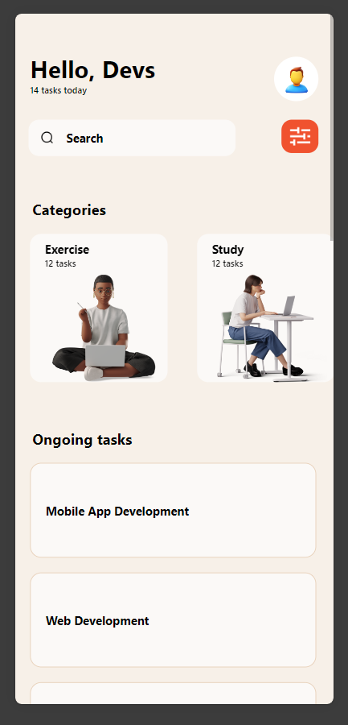
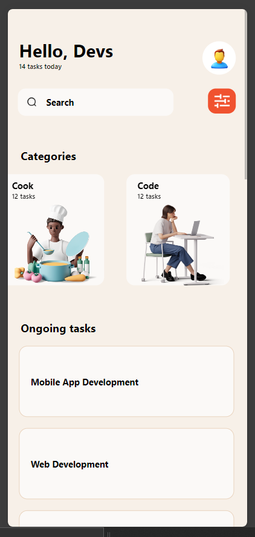
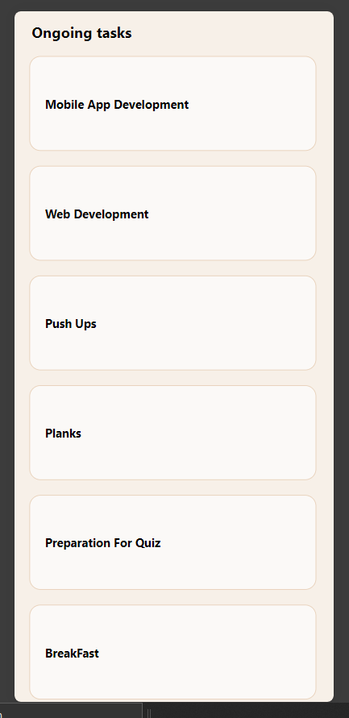

# To Do App (Fontend)

## Student ID: 11207924

### The components used in this app include: 

- View:  It serves as a container that supports layout with Flexbox, style, touch handling, and accessibility controls.

- Text:  is used to display text in the app. It supports nesting, styling, and touch handling.

- ScrollView: provides a scrolling container that can hold multiple components or views. It is useful when the content exceeds the screen size.

- TextInput: this component is used to create input fields where users can enter text. It supports various configurations such as placeholders, secure text entry for passwords, and more.

- Stylesheet: the StyleSheet module is used to create styles for React Native components. It allows you to define styles similarly to CSS but optimized for mobile development.

- Button: is used to create a clickable button. It can trigger actions such as navigation or submitting a form when pressed.

- FlatList or SectionList for rendering lists of tasks: these are components for rendering lists of data. FlatList renders a basic list, while SectionList renders grouped sections of data. 

- Image for icons and displaying images: this component is used to display images in the app. It supports various image formats and can be styled.

- Custom components:  are user-defined elements that encapsulate reusable code, styles, and functionality. the custom components created for this application include; HeaderFrame, Categorycard,CustomButton, Tasks and the SearchFrame.

### Screenshots of Application

